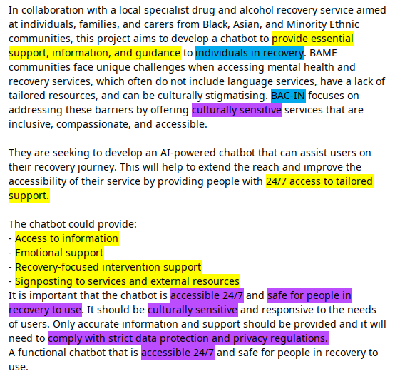
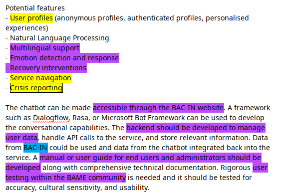
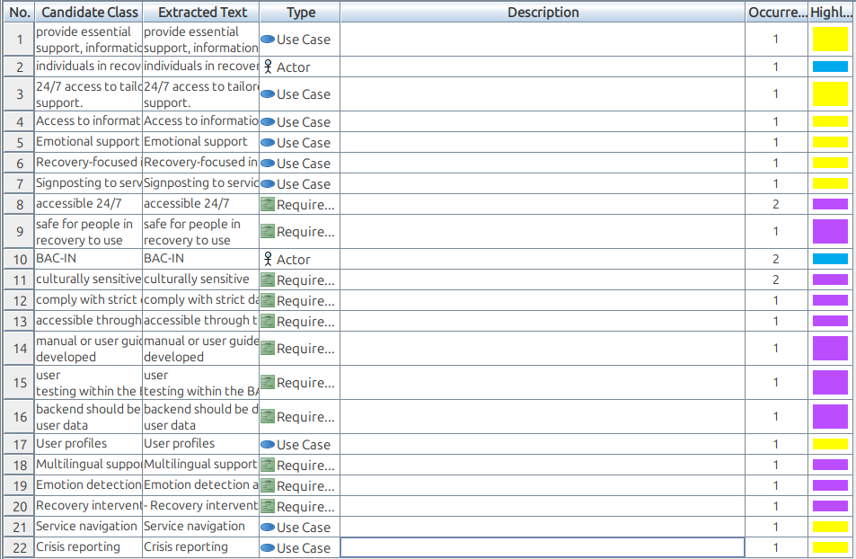
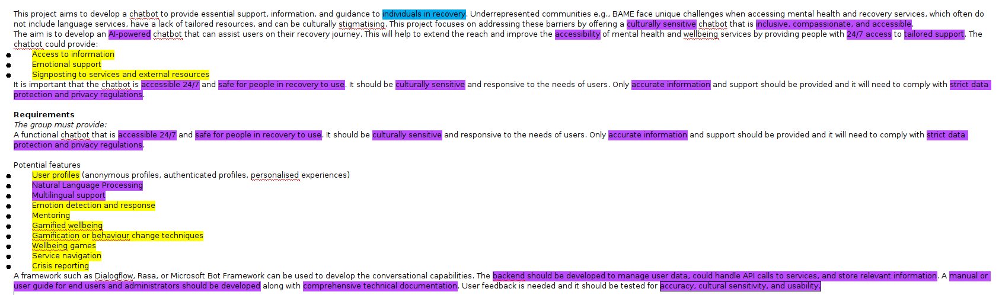
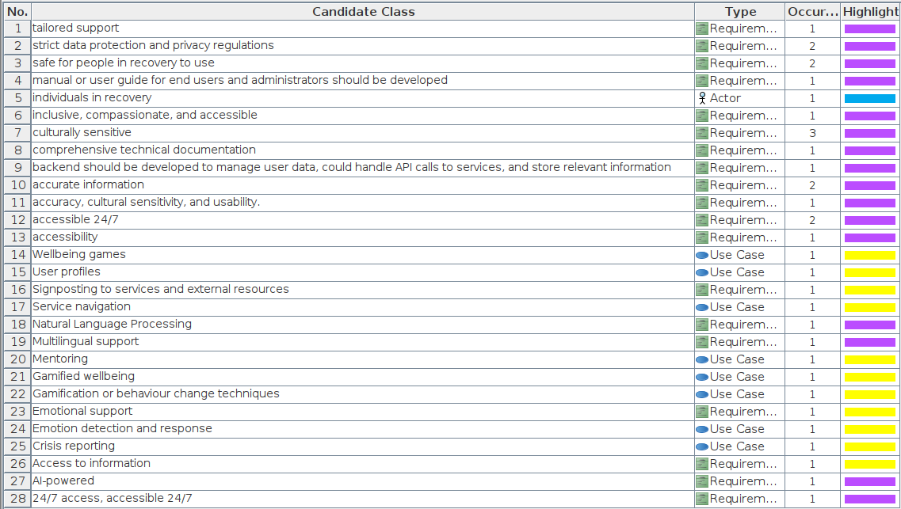

# Software Requirements Specification Document

These requirements are based on the brief provided by BAC-IN and the further discssions we had with them during the pitch. 

__If we are no longer able to work with BAC-IN, these requirements might change as the product will become more broad and less specific to BAC-IN's 'lived experience' approach to recovery.__

## Initial Textual Analysis - BAC-IN Version

_Highlighting key:_

- _Purple_ text means non-functional requirement.
- _Yellow_ means use-case.
- _Blue_ mean an actor.

## Updated Textual Analysis - Internal Version

Unfortunately, we were unable to continue working with BAC-IN due to unforeseen budget issues within the charity which led to their project director no longer being able to work with us.

In response, we have pivoted the product to be less BAC-IN specific and more broadly mental health focused (rather than narrowly targetted for addiction recovery.) In addition, this provides an opporunitiy to widen the reach of our product; as we can target it beyond BAME specific audiences - while certainly still keeping it, as well as inclusion and cultural sensitivity, as a vital factor to consider.

Our project supervisor kindly provided us with an updated brief which takes these changes into account:

## Purpose

## Intended Audience 

## Product Scope

## Definitions and Acronyms

## Assumptions and Dependencies

## Functional Requirements

## External Interface Requirements

## System Features

## Non-Functional Requirements

